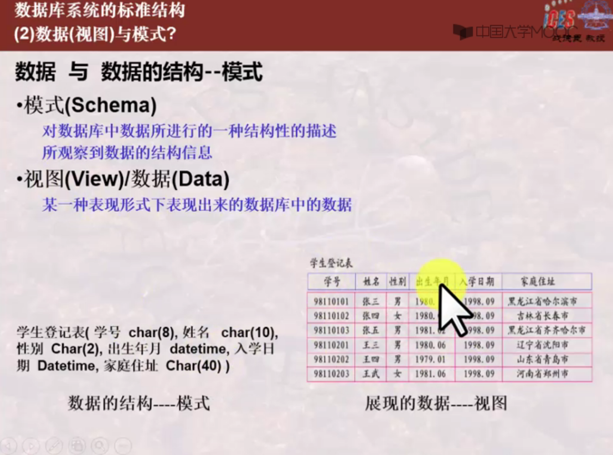
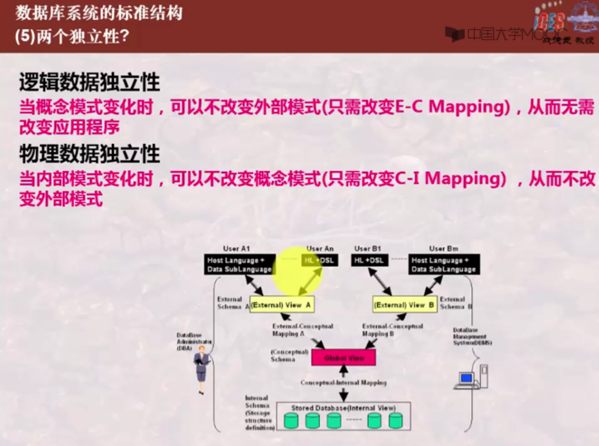

# 数据库基础入门

## 1. 为什么要使用数据库？

要想回答这个问题，首先需求一些前提认知的铺垫：

<pre>
<b>1. 信息：</b>
   用通俗的一点的话描述：世间万物所包含的内容，如一块石头，他坚硬、黄色、圆形、尝起来甜。。。这些内容就是这个石头所包含的信息；如“xx月xx日 足球比赛 a队打赢了b队”，从这句文字中你了解到的内容，就是这句文字载体所携带的信息；
<b>2. 数据：</b>
   数据一词是相对于计算机而言的，总所周知，计算机的基础组成可以分为硬件和软件，软件的基础为01,用01来表达信息（如用01的组合表示一个文字，这些文字组成句子  =>  实现用01来记录信息），这些01我们称之为数据。
   它是记录信息的一种新的方式。
</pre>

好的，当你知道这两个基础知识后，我们继续来回答上面的问题：信息在生灵世界被赋予了一个性质——价值性（如我知道这个果子是能吃的，这个信息就对动物产生了价值），当信息存在价值，那么信息就是一种资源，能给人带来利益，人自然也就会保存信息，随着信息量的增加，这就导致了信息管理的必要性，也就是数据库产生的理由。

## 2. 什么是数据库系统？

知道了为什么要使用数据库，下面就让我们来深入了解下数据库；

首先，数据库的使用是为了信息管理，但是，单单是一个数据库远不能满足我们管理数据的需求，因此，我们将使用数据库来进行信息管理的整个环节称为数据库系统；

让我们通过下面两张图片来了解什么是数据库系统，及数据库系统的组成和现实的对应；数据库系统是数据库的工作环境；计算机基础系统是数据库系统得以运行的土壤；数据库管理系统对数据库进行管理，提供方便快捷的数据库操作；数据库管理系统可以给各种不同的用户使用，为了提高普通用户的使用体验（不需要了解数据库相关知识），所以数据库应用系统应运而生；为了保证整个数据库系统的平稳运行，需要数据库管理员对数据库系统进行日常的维护工作；

## 3.如何对数据库进行管理？

我们通过数据库管理系统来实现对数据库的管理；我们对数据的管理主要分为存储、使用、控制、维护；所以数据库管理系统使用一种规范语言SQL来实现数据相关功能，SQL主要分为以下组成：

1. 数据定义语言（DDL: Data Definition Language）：提供给用户定义数据结构，以实现数据的存入；
2. 数据操作语言（DML: Data Manipulation Language）：提供给用户进行数据操作
3. 数据控制语言（DCL: Data Control Language）：提供给用户进行数据控制

数据库管理系统提供其他一系列程序实现对数据库的维护工作：转储、恢复、重组、性能监测、分析。

## 4.数据库管理系统是如何运转的？

其中，数据字典是数据库的重要组成部分，存储元数据。

1. 用户A通过应用程序A向关系数据库管理系统发出调用数据库数据的命令。
2. 关系数据库管理系统首先对命令进行进行语法检查，检查通过后进行语义检查和用户存取权限检查。具体做法是，关系数据库管理系统读取数据字典，检查是否存在该关系及相应的字段、该用户能否读取它们等，确认语义正确、存取权限合法后便决定指定该命令，否则拒绝执行，返回错误信息。
3. 关系数据库管理系统执行查询优化。优化器要根据数据字典中的信息进行优化，并把该命令转换成一串单记录的存取操作序列。
4. 关系数据库管理系统执行存取操作序列（反复执行以下各步，直至结束）。
5. 关系数据库管理系统首先在系统缓冲区查找记录，若找到满足条件的记录则转到10，否则转到6。
6. 关系数据库管理系统查看存储模式，决定从哪个文件、用什么方式读取哪个物理记录。
7. 关系数据库管理系统根据6的结果，向操作系统发出读取记录的命令。
8. 操作系统执行读取数据的相关操作。
9. 操作系统将数据从数据库的存储去送至系统缓冲区。
10. 关系数据库管理系统根据查询命令和数据字典的内容导出用户所要读取的记录格式。
11. 关系数据库管理系统将数据记录从系统缓冲区传送到应用程序A的用户工作区。
12. 关系数据库管理系统将执行状态信息。如成功读取或不成功的错误指示、例外状态信息等返回给应用程序A。
    根据数据库管理系统层次结构，可以将以上操作对应相应的层次：
    **应用层： 1
    语言处理层：2、3
    数据存取层：4、10、11、12
    数据存储层：5、6、7
    操作系统：8、9**

## 5.为什么这样设计数据库系统？

我们设计一个系统要保证该系统的各个性能，那么在数据库系统中最重要的目的是什么？就是能够将用户需求的数据更快更准确的传到用户手中，那么如何才能将数据更快更准确的传到用户手中？

让我们先来理一理脑子的知识，存在数据库中的数据是以某种格式存储的，用户需要的数据也是用某种格式显示的，两个格式之间 一个是物理存储结构（内模式），一个是逻辑数据结构（模式），需要建立两者之间的关系的映像来进行丝滑数据转换，又因为用户所需求的数据并不是相同的，所以逻辑数据又要再分出一层结构来记录每个需求不同的用户所需要的不同的数据（外模式），而分出的逻辑数据和原先的逻辑数据结构可能也有所不同，所以又需要一级映像来完成两者间的丝滑转换；至此，就是数据库系统的三级结构和两级映像；

下面让我们来系统的认知一下三级结构、两层映像

三级结构分为：外模式，模式，内模式

1. 外模式是模式的子集

数据的结构 => 模式（外模式，[逻辑]模式、内模式）

数据 => 视图 （[外]视图、逻辑视图、内视图）  []的内容可能会省略

## 6.这样设计数据库系统有什么好处？

通过三级结构和两级映像保证了任意一个结构的变动并不会对其他结构产生影响，减少了工作量，提高个效率；间接也实现了逻辑数据独立性和物理数据独立性；

## 7. 模式如何记录？

我们知道了如何记录数据，是通过模式来规范，那么模式又是如何记录的呢？我们知道模式相互之间也是不一样的，这就说明模式是存在进一步抽象的，我们把模式的进一步抽象叫作数据模型：

数据模型有三大经典数据模型：

1. 关系模型：表 的形式组织数据
2. 层次模型：树 的形式组织数据
3. 网状模型：图 的形式组织数据

我是这样理解的：数据与数据之间存在某种关系，可以用层次模型表示，可以用网状模型表示，但是使用这种表示方式并不利于数据的使用，我们有时只是单独需要某个数据，并不关系它和其他数据之间的真实关系，使用层次、网状模式记录数据很不方便，所以使用表的形式来记录数据，即可以完整记录关系、又可以通过表与表之间的关系实现我们想要的数据逻辑关系，所以现在数据库通常使用表的方式记录数据；（网状、层次都可以直接用表格表示，且直接，但有的使用网状和层次又能有效避免数据冗余，根据用户逻辑需求来选择使用哪种关系模型）

> 举例：希望记录学生数据
>
> ~~~mermaid
> graph LR
> 学生 --> A(姓名)
> 学生 --> 年龄
> 学生 --> 学校
> 学生 --> 院系名称
> 学生 --> 院系编号
> 学生 --> 班级编号
> 学生 --> 班级名称
> 
> B(学校) --> C(院系=院系编号,院系名称) 
> C --> D(班级=班级编号,班级名称)
> D --> E(学生)
> E --> F(姓名)
> E --> H(年龄)
> ~~~
>
> 这是两种设计思路 来帮助理解数学模型
>
> 上一种 如果这样记录数据，院系、班级数据很明显会冗余
>
> 如果按下一种查找起来又很麻烦
>
> 所以 如果在学生表加上学号、院系编号、编辑编号查询也方便、记录也减少了冗余

