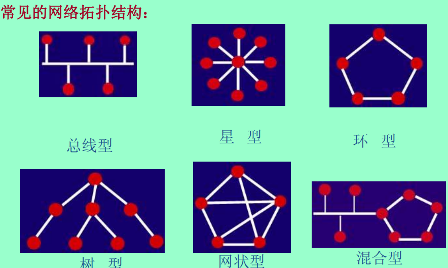
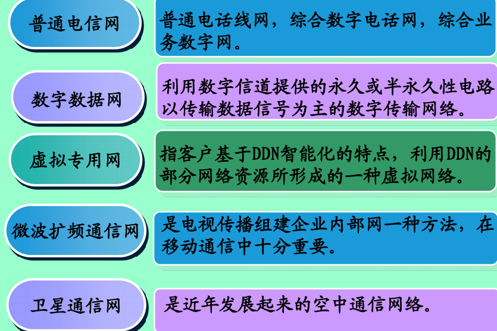
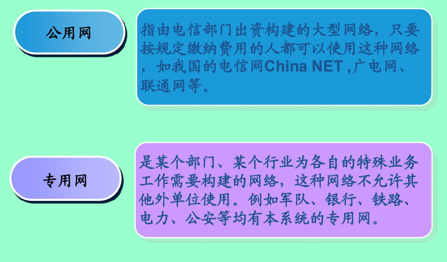
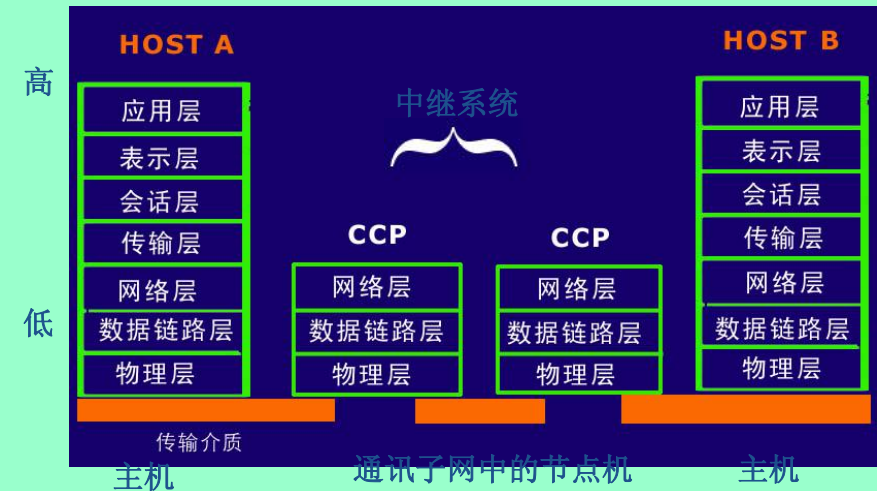
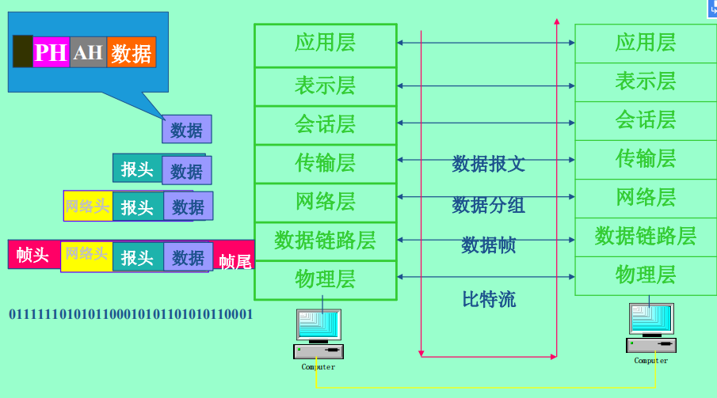
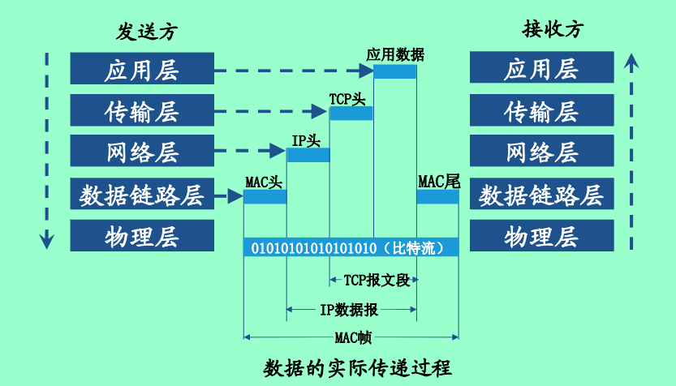
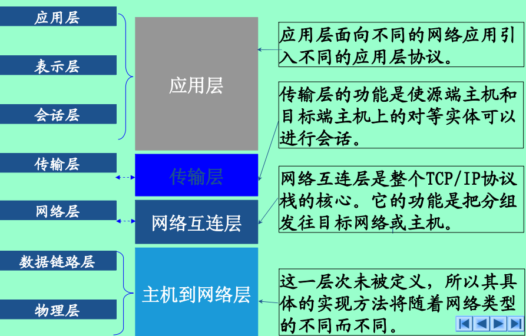
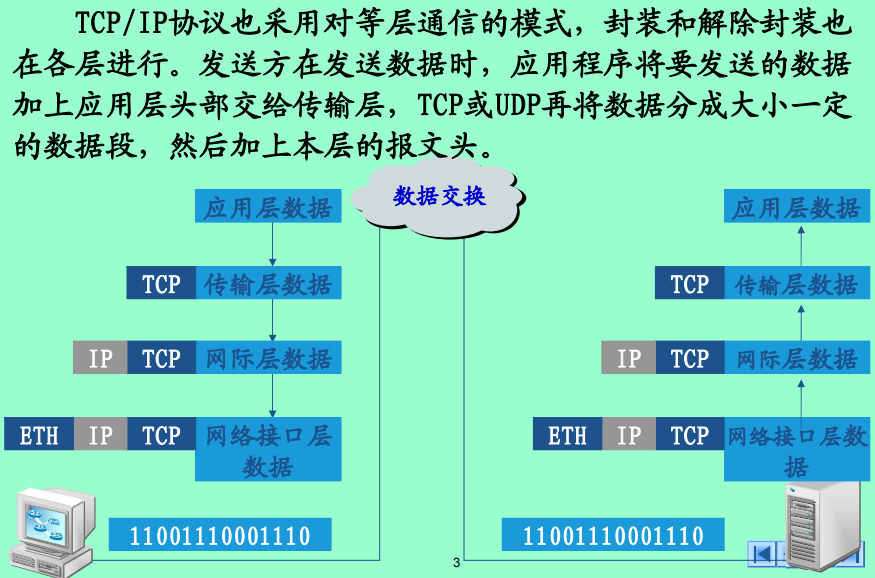
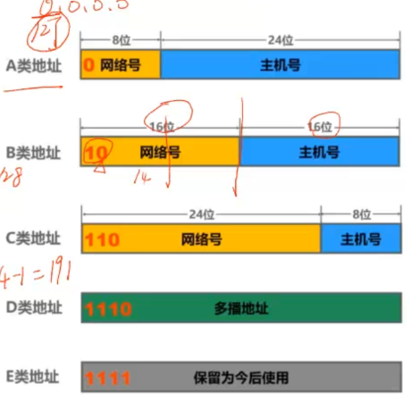
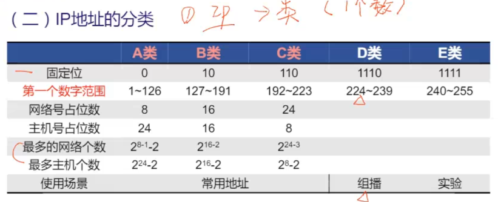

# 网络基础

## 1. 什么是网络

> 网络定义：网络是由若干节点和连接这些节点的链路构成，表示诸多对象及其相互联系。在计算机领域中，**网络是信息传输、接收、共享的虚拟平台，通过它把各个点、面、体的信息联系到一起，从而实现这些资源的共享**。

21世纪的重要特征就是数字化、网络化和信息化，是一个以网络为核心的信息时代。这里所说的网络就是指**“三网”**——**电信网络**、**有线电视网络**和**计算机网络**。这三种网络向用户提供的服务不同：电信网向用户提供电话、电报、传真业务，有线电视网络向用户提供各种电视节目，计算机网则使用户能够迅速传递数据文件，查找并获取各种有用资料。随着技术的发展，电信网和有线电视网络逐渐融入了计算机网络技术，形成我们现在所说的“三网融合”。现在的计算机网络不仅能够传送数据，还能够向用户提供打电话、听音乐、观看视频节目等服务。

### **<**计算机网络的定义>

计算机网络技术在不断发展，在不同的阶段，它的定义也不尽相同。从目前的现状来看，我们可以这样描述：计算机网络是指将地理位置不同的具有独立功能的多台计算机及其外部设备，通过通信设备和线路连接起来，在网络操作系统、网络管理软件和网络通信协议的管理下，实现资源共享和信息传递的计算机互联系统。

这个描述包括了4个方面的含义：

① 计算机之间相互独立自治：从数据处理能力方面看，计算机既可以单机工作，也可以联网工作；从分布的地理位置来看，计算机是独立的个体，可以远在天边，也可以近在眼前。

② 通信线路：计算机互相通信交换信息，必须有一条通道。这条通道的连接是物理的，由物理介质来实现（例如铜线、光纤、微波、卫星等）；

③ 网络协议：计算机之间的信息交换，必须要遵守统一的约定和规则。

④ 资源共享：任何一台计算机可以将本身的资源共享给其它处于该网络中的计算机实体，这些被共享的资源可以是硬件，也可以是软件和信息资源等。

## 2. 网络连接的多种方式

由上可知,网络就是节点和连接节点的链路构成的;点与线的研究有个专门的学科叫拓扑学

> **拓扑学是几何学的一个分支。拓扑学首先把实体抽象成与其大小、形状无关的点,将连接实体的线路抽象成线,进而研究点、线、面之间的关系,即拓扑结构(Topology Structure)。**
>
> **在计算机网络中，把服务器、工作站、通信设备等网络单** **元抽象为“点”，把网络中的电缆、双绞线等传输介质抽象为“线”。计算机网络的拓扑结构就是指计算机网络中的通信线路和结** **点相互连接的几何排列方法和模式。**

因此我们对网络连接的研究也叫网络拓扑结构;常见的网络拓扑结构为:

设计线路目标大概分为两种:

1. 便于拓展

   代表结构:总线型、星型、树型

2. 成本低

   代表结构：树形、总线型

3. 可靠性高

   代表结构：环形（各节点负载均衡）、网状（冗余链路，单一线路、节点故障不影响整个网络工作）

## 3. 网络实现的多种方式

### 1. 按覆盖范围

计算机网络分类的方法很多，可以从不同的角度观察网络系统、划分网络。根据不同的分类原则，我们可以得到不同类型的计算机网络。

**1按网络覆盖范围分，计算机网络分为个人区域网PAN、局域网LAN、城域网Man、广域网Wan和互联网internet。**

| **分布距离**       | 所处位置         | **网络分类**   | **传输速度**      |
| ------------------ | ---------------- | -------------- | ----------------- |
| **1-10****米**     | **同一房间**     | **个人区域网** | **2kbps-400Mbps** |
| **10****米**       | **同一房间**     | **局域网**     | **10M-10Gbps**    |
| 100米              | **同一建筑物内** |                |                   |
| 1千米              | **同一个园区**   |                |                   |
| **10****千米**     | **同一座城市**   | **城域网**     | **64K-10Gbps**    |
| **100****千米**    | **同一个国家**   | **广域网**     | **10K-5Gbps**     |
| **1000****千米**   | **同一个大陆**   |                |                   |
| **10 000****千米** | **同一个行星**   | **互联网**     | **10K-100Mbps**   |

### 2. 按传输介质

计算机网络分为

由同轴电缆、双绞线或光纤来连接的**有线网**

采用无线通信技术实现的**无线网**。

### 3.按**网络传输技术分类**

计算机网络可分为普通电信网、数字数据网、虚拟专用网、微波扩频通信网、卫星通信网5种类型。

### **4**.按网络的使用性质分类

公用网和专用网。

## 4. 网络如何统一？

从上面网路的种类我们就不难看出网路多种多样，在加上网络必定能给人带来巨大的利益，所以当网络这一概念出现的时候，世界上就有多家公司按照自己的规定组建网络，这就导致了一个问题，各家不同的网络、传输介质不同的网络之间无法实现通讯，这极大的限制了网络的发展；

为了解决以上问题，传输规则上面通过制定统一的规则来解决（OSI、TCP/IP），物理传输介质方面通过专门的物理机器实现转换（路由器）

## 5. 统一的标准

### 1. OSI七层协议

| 层次 | 名称       | 作用                                                         | 功能                                                         |
| ---- | ---------- | ------------------------------------------------------------ | ------------------------------------------------------------ |
| 1    | 物理层     | 数据单位： 比特流  互连设备：中继器、集线器             | 通过机械和电气的互联方式把实体连接起来， 让数据流通过   |
| 2    | 数据链路层 | 数据单位： 帧  互连设备：网桥、交换机                   | 进行二进制数据块传送、 并进行差错检测和数据流控制       |
| 3    | 网络层     | 数据单位： 分组  互连设备：路由器                       | 通过分组交换、路由选择为传输层提供端到端 的交换网络数据 |
| 4    | 传输层     | 数据单位： 报文  互连设备：中继器                          集线器                          网关 |                                                              |
| 5    | 会话层     | 互连设备：网关       (在传输层及以上层次)               |                                                              |
| 6    | 表示层     | 互连设备：网关       (在传输层及以上层次)               |                                                              |
| 7    | 应用层     | 互连设备：网关       (在传输层及以上层次)               |                                                              |

### 2. TCP/IP 协议

因为种种原因（提出时间过晚，TCP/IP占据大量市场），OSI协议并没有被广泛使用，TCP/IP协议是目前最主流的网络传输协议。

#### 流程分析

需求：你要想打开一个网页

首先，你操作的是浏览器，浏览器先分析你要想哪台计算机发送请求（DNS域名解析），然后网络服务程序根据此目标地址（套接字：IP+端口）和本机地址建立连接（会话：确认两台计算机能够交换数据），然后浏览器将你要请求的信息进行编码（转换成协议规定的格式，传输层），将目标地址和数据内容组合好给网络服务程序，【网络服务程序根据你的目标地址选择如何物理转发（通过MAC确认要转发的网卡地址），（因为你的目标地址不在同一子网下）信息被一层一层传递到了管理你的计算机所在的网络的路由器（网络层），路由器根据你的目标地址智能选择下一个要转发的路由器（在此过程中，依次是网络层->数据链路层->物理层->数据链路层->网络层），一直到包含目标地址的路由器，路由器开始内部进行数据传递（网络层->数据链路层->物理层->数据链路层>物理层->数据链路层），一直到目标计算机（物理层->数据链路层->网络层->传输层->应用层）】此过程中数据头一直被加工、处理，以保障传输的准确性，且只要需要网络功能，这个步骤不断发生；然后当双方确认不需要继续连接时，删除套接字，会话结束；

## 6. 常见的物理设备

### 1. 中继器

中继器可以“延长”网络的距离，在网络数据传输中起到放大信号的作用；

### 2. 集线器

对信号进行放大整形，延长网路距离，每个端口都可以与传输介质相连，可将多个节点汇接，起到中枢的作用；

### 3. 交换机

将数据帧从一个网段转发到另一个网段。（可看作一种智能化的集线器）

### 4. 网桥

将两个相似的网络连接起来，并对网络数据的流通进行管理；

### 5. 路由器

提供多个独立子网互相连接服务的一种存储转发设备。

### 6. 网关

最复杂的网络设备，主要实现协议转换，可以连接不同网络协议的异构网络，实现各种分布式的应用。

## 7. IP

为了在网络上定位每一个数据请求，使用IP的方式进行定位（点分十进制）；将网络规模大小分为5类（A~E）

主机全0、全1为特殊地址，不可用(全0为网络地址、全1为广播地址)

### 子网

A~C类网址固定了网络位为多少，但是为了资源更好的利用，可以在已有的网络位上增加位数表示该类网络的子网， 及（255.255.255.0->255.255.255.129【1000 0000】）

## 8. TCP/UDP