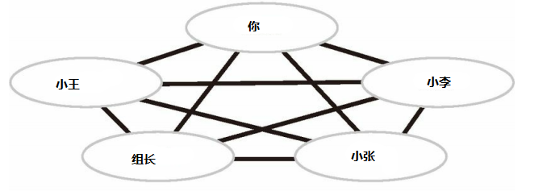

# 网络基础

## 1. 为什么需要网络？

这个问题很容易回答，从数据库基础一篇我们了解到信息的价值性。如何将信息的价值发挥出来？信息的传递、共享就要放上思考的台面上，网络就是这个问题的答案；

> 网络定义：网络是由若干节点和连接这些节点的链路构成，表示诸多对象及其相互联系。在计算机领域中，**网络是信息传输、接收、共享的虚拟平台，通过它把各个点、面、体的信息联系到一起，从而实现这些资源的共享**。

## 2. 如何实现计算机连接？

网络的目的就是为了实现信息的共享（其中主要需求为信息的传输），假设让我们回到问题出现的时代，我们拥有了计算机，计算机能够管理记录许多信息，但是信息的传递相当麻烦，需求人工传递，（想象一下，你和你的同事小王明明面对面工作，但是传个数据文件却要来回跑是什么感受）这时，我们出现的第一个想法一定是计算机能不能相互连接，来传递信息，然后你们找了根数据线（用来传递电信号），将你的电脑和小王的电脑连接起来，数据线两边装上电信号接收器，因为计算机只能接收电信号（高低电平），而且计算机存储内部使用01来记录数据的，所以你们很自然的规定高电平是1，低电平是0，以此来确认文件的数据；同时，因为计算机存在多个硬件，所以你要确定用那个硬件去接收和发送数据，于是你们规定了以下数据传输规则；（MAC随着要发送的硬件地址不同不停变化）

> ~~~
> 【（0123400）0101010101010110101】 开头6位表示要传到的硬件编号
> ~~~
>
> | MAC     | 数据内容            |
> | ------- | ------------------- |
> | 0123400 | 0101010101010110101 |

于是你们就是实现了两台计算机之间的信息交互，可喜可贺；

## 3.  如何实现多台计算机连接？

故事继续：隔壁小李一看，我艹，你们这个好啊，给我也整一个，你一想简单啊，于是你也给小李装了条数据线，于是你们三个一起愉快的传起了数据；

~~~mermaid
graph LR
A(你) --> B(小王)
A--> C(小李)
B --> C
~~~

这时，你们组长一看，你们这个不错啊，给整个小组搞上，你当仁不让的接到了这个新活，你这时犯了难，小组5个人，每个计算机都和其他计算机相连，这线也太多了；

你一想：要不都连我吧，我给他们转发；于是变成了这样

~~~mermaid
graph LR
A(你) --> B(小王)
A(你) --> C(小李)
A(你) --> D(小张)
A(你) --> E(组长)
~~~

你想：光接收数据我也不知道转给谁啊，于是你便定下规定，大家在发文件前先发要发给谁（IP），发给我 就是000，发给组长 就是 001，发给小王 就是 002，发给 小李 就是003，发给小张 就是 004；于是发送格式变成了

> ~~~
> 【（000）（000001）0101010101010110101】 开头3位表示目标 中间表示硬件编号
> ~~~
>
> | IP   | MAC    | 数据内容            |
> | ---- | ------ | ------------------- |
> | 000  | 000001 | 0101010101010110101 |

 你在自己的计算机里写下了转发表,根据IP 进行数据转发

> | IP   | MAC    | 端口号 |
> | ---- | ------ | ------ |
> | 001  | 000002 | 1      |
> | 002  | 000003 | 2      |
> | 003  | 000004 | 3      |
> | 004  | 000005 | 4      |

于是你和你的小伙伴又能愉快的玩耍了；（局域网）

## 5. 如何实现不同区域计算机连接？ 

你的创举被组长推荐很快在公司风靡了起来，这天，公司安排你们小组和其他三个小组一起进行某项工作，很自然你们就想使用计算机传输文件，你和另三个小组负责转发的计算机进行连接，