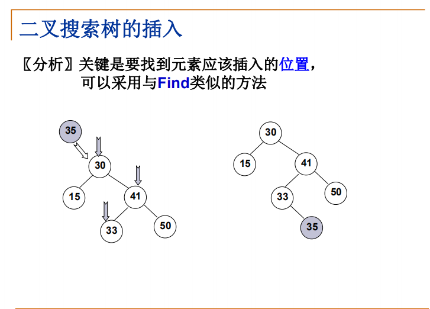
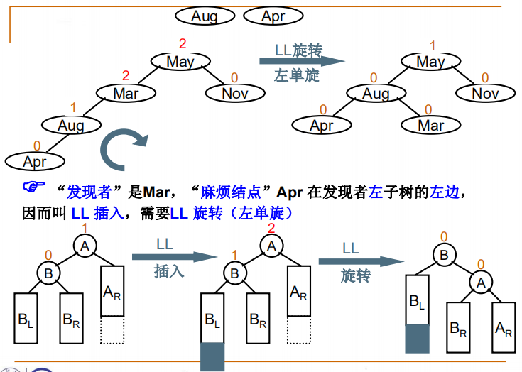

# 数据结构基础

首先先让我们有一个大体框架然后再进行深入学习；

## 基础定义

### 数据结构的概念

数据机构是一门研究【非数值计算】**程序设计问题** 中 **计算机的操作对象** 以及他们之间的 **关系** 和 **操作**（完成这些操作所用的方法就是**算法**） 的学问；

### 数据结构的分类


#### 1. 按逻辑关系分类：


1. 集合
2. 线性
   1. 线性表
   2. 栈
   3. 队列
3. 树
   1. 普通树
   2. 二叉树
      1. 完美二叉树（满二叉树）
         1. 完全二叉树
      2. 二叉查找树
         1. 堆
         2. 哈夫曼树
4. 图
   1. 方向
      1. 有向图
      2. 无向图
   2. 权重
      1. 有权图
      2. 无权图

#### 2. 按存储结构分类：

1. 顺序存储结构（例：数组）

   ​	**顺序存储方法**是把逻辑上相邻的结点存储在物理位置相邻的存储单元里。

2. 链式存储结构（例：链表）

   ​	**链式存储方法**不要求逻辑上相邻的结点在物理位置上也相邻，结点间的逻辑关系是由附加的指针字段表示的。

#### 注意点

​	逻辑和物理是分开的。

【举例：线性结构可以用数组表示也可以用链表表示，树可以用数组表示也可以用链表表示，其他同理】

## 零、算法(Algorithm)  

本节只进行简单的表述，关于算法设计的数学相关知识暂时不做讲解；

### 定义

1. 一 个 有 限 指 令 集  
2. 接 受 一 些 输 入 （ 有 些 情 况 下 不 需 要 输 入 ）  
3. 产 生 输 出  一 定 在 有 限 步 骤 之 后 终 止  
4. 每 一 条 指 令 必 须  。 有 充 分 明 确 的 目 标 ， 不 可 以 有 歧 义  。 
5. 计 算 机 能 处 理 的 范 围 之 内  
6. 描 述 应 不 依 赖 于 任 何 一 种 计 算 机 语 言 以 及 具 体 的 实 现  手 段 

### 什 么 是 好 的 算 法 ？  

- 空 间 复 杂 度 S （n ） 

   根 据 算 法 写 成 的 程 序 在 执 行 时  **占 用 存 储 单 元 的 长 度** 。 这 个 长 度 往 往 与 输 入 数 据 的  规 模 有 关 。 空 间 复 杂 度 过 高 的 算 法 可 能 导 致 使 用 的  内 存 超 限 ， 造 成 程 序 非 正 常 中 断 。  

- 时 间 复 杂 度 T（n）

  根 据 算 法 写 成 的 程 序 在 执 行 时  **耗 费 时 间 的 长 度** 。 这 个 长 度 往 往 也 与 输 入 数 据 的 规  模 有 关 。 时 间 复 杂 度 过 高 的 低 效 算 法 可 能 导 致 我 们  在 有 生 之 年 都 等 不 到 运 行 结 果 。
  
  两个复杂度越低越好

### 注意点

1. 如何计算算法时间复杂度

   1. 先明确占用时间的 核心部分
   2. 循环的次数
   3. 因为计算机加减很快，所以以乘除计算算法的时间复杂度，即一共执行了多少次乘法；

2. 关于算法

   当看到复杂度为n²【循环套循环】时，要想办法转换成 n㏒n 【】的复杂度更佳 

3. 关于递归

   递归虽然逻辑清晰，但是可能占用空间大，导致分配内存溢出，程序出错，所以要注意递归算法的空间复杂度；

### 举例

> ### 计算空间复杂度
>
> ### 计算时间复杂度
>
> ### 复杂度趋势图表
>
> 占用资源 f 从n => 2^n 依次增加，所以复杂度最好是 n 的表达式

## 一、线性结构

### 线 性 表 (Linear List)  

有序表：由 **同 类 型** 数 据 元 素 构 成**有 序 序 列** 的 **线 性 结 构**  

- 有序：主要靠定义的逻辑判断，有逻辑顺序则为有序

- 表 中 元 素 个 数 称 为 线 性 表 的 长 度  龙 线 性 表 没 有 元 素 时 ， 称 为 空 表  

- 表 起 始 位 置 称 表 头 ， 表 结 束 位 置 称 表 尾

> ### 案例
>
> 1. 需求：用程序实现一个一元多项式及其运算（计算机最初的需求就是用于计算）
>
>    实现方式为数组，但是表示顺序的逻辑不同，记录方式也不同；但两者都叫线性表；
>
> 2. 
>
>    ```java
>   /**
>     * @类: LIstStudy
>     * @描述: 线性结构学习
>     * @date: 2020/12/14
>     * @author: Admin
>     * @ver 1.0.0
>     * @since JDK 1.8
>     */
>    public class ListStudy {
>    
>        /**
>         * 自定义数据元素
>         */
>        static class Data{
>            /**
>             * 系数
>             */
>            int coefficient;
>            /**
>             * 指数
>             */
>            int index;
>    
>            public Data(int coefficient, int index) {
>                this.coefficient = coefficient;
>                this.index = index;
>            }
>    
>            @Override
>            public String toString() {
>                return coefficient<0?
>                        coefficient+"x^"+index:"+"+coefficient+"x^"+index;
>            }
>        }
>    
>        public static void main(String[] args){
>            listOne();
>            listTwo();
>        }
>    
>        /**
>         * 方法1
>         * 表示 一元方程组 f(x)=4x^5 - 3x^2 + 1
>         * 用数组下标的有序性 表示 该线性的前后关系
>         */
>        public static void  listOne(){
>            // 1. 以数组下标表示线性关系（从前到后）  逻辑有序性体现在数组的下标上
>            Data[] datas = new Data[3];
>            Data a = new Data(4, 5);
>            Data b = new Data(-3, 2);
>            Data c = new Data(1, 0);
>            datas[0] = a;
>            datas[1] = b;
>            datas[2] = c;
>            for (Data da:datas
>                 ) {
>                System.out.print(da);
>            }
>        }
>    
>        /**
>         * 方法2
>         * 表示 一元方程组 f(x)=4x^5 - 3x^2 + 1
>         * 用数组下标的有序性 表示 该线性的前后关系
>         */
>        public static void  listTwo(){
>            // 1. 以数组下标表示线性关系（从前到后）  逻辑有序性体现在数组的下标上 为 i*2
>            Data[] datas = new Data[7];
>            Data a = new Data(4, 5);
>            Data b = new Data(-3, 2);
>            Data c = new Data(1, 0);
>            datas[2] = a;
>            datas[4] = b;
>            datas[6] = c;
>            System.out.println();
>            for (Data da:datas
>            ) {
>                System.out.print(da);
>            }
>        }
>    }
>    
>    //输出：  4x^5 - 3x^2 + 1
>    ```

#### - 广义表

- 广义表是线性表的推广

- 对于线性表而言，n个元素都是基本的单元素；

- 广义表中，这些元素不仅可以是单元素也可以是另一个广义表。
- 广义表示线性表的推广，但这不代表他就是线性结构，他只是线性表的推广，所以本质上非线性结构
- **广义表**是一种非线性的[数据结构](https://link.zhihu.com/?target=https%3A//zh.wikipedia.org/wiki/%E6%95%B0%E6%8D%AE%E7%BB%93%E6%9E%84)。但如果广义表的每个元素都是原子，它就变成了[线性表](https://link.zhihu.com/?target=https%3A//zh.wikipedia.org/wiki/%E7%BA%BF%E6%80%A7%E8%A1%A8)。广义表广泛地用于[人工智能](https://link.zhihu.com/?target=https%3A//zh.wikipedia.org/wiki/%E4%BA%BA%E5%B7%A5%E6%99%BA%E8%83%BD)等领域的[LISP](https://link.zhihu.com/?target=https%3A//zh.wikipedia.org/wiki/LISP)语言。

### 栈

- 堆 栈 (Stack) ： 具 有 一 定 操 作 约 束 的 线 性 表 
- 只 在 一 端 （ 栈 顶 ， Top) 做 插 入 、 删 除 
  - 插 入 数 据 ： 入 栈 (Push) 
  - 删 除 数 据 ： 出 栈 (Pop) 
  - 后 入 先 出 ： Last In First Out （ LIFO ） 

~~~java
实现：java.util.Stack
~~~

### 队列

队 列 (Queue) ： 具 有 一 定 操 作 约 束 的 线 性 表 

- 插 入 和 删 除 操 作 ： 只 能 在 一 端 插 入 ， 而 在 另 一 端 删 除 。 
- 数 据 插 入 ： 入 队 列 (AddQ) 
- 数 据 删 除 ： 出 队 列 (DeleteQ) 
- 先 来 先 服 务 
- 先 进 先 出 ： FIFO  

## 二、树形结构

### 0.基础了解

#### 树的定义


#### 树 的 一 些 基 本 术 语 

1. 结 点 的 度 (Degree) ： 结 点 的 子 树 个 数 
2. 树 的 度 ： 树 的 所 有 结 点 中 最 大 的 度 数 
3. 叶 结 点 (Leaf) ： 度 为 0 的 结 点 
4. 父 结 点 〈 Parent) ： 有 子 树 的 结 点 是 其 子 树 的 根 结 点 的 父 结 点 
5. 子 结 点 (Child) ： 若 A 结 点 是 B 结 点 的 父 结 点 ， 则 称 B 结 点 是 A 结 点 的 子 结 点 ： 子 结 点 也 称 孩 子 结 点 。 
6. 兄 弟 结 点 (Sibling ） ： 具 有 同 一 父 结 点 的 各 结 点 彼 此 是 兄 弟 结 点 。 
7. 路 径 和 路 径 长 度 ： 从 结 点 n 到 nk的 路 径 为 一 个 结 点 序 列 n ,n2 ，n3 … , nk。路 径 所 包 含 边 的 个 数 为 路 径 的 长 度 。
8. 祖 先 结 点 (Ancestor): 沿 树 根 到 某 一 结 点 路 径 上 的 所 有 结 点 都 是 这 个 结 点 的 祖 先 结 点 。
9. 子 孙 结 点 (Descendant) ： 某 一 结 点 的 子 树 中 的 所 有 结 点 是 这 个 结 点 的 子 孙 。 
10.  结 点 的 层 次 (Level) ： 规 定 根 结 点 在 1 层 ， 其 它 任 一 结 点 的 层 数 是 其 父 结 点 的 层 数 加 1 
11. 树 的 深 度 (Depth) ： 树 中 所 有 结 点 中 的 最 大 层 次 是 这 棵 树 的 深 度 。 

#### 树的特点

> 案例引入：
>
> 1. 同一个有序线性表进行查询
>
>    算法1：从头到尾 进行遍历
>
>    算法2：二分查找法
>
>    - 算法2的效率比算法1的效率要高
>      - 算法2 进行查找 会形成一个判断树  –》 树的查询效率一般要比线性表要高（算法复杂度比较）

树的特点：查询效率高

#### 树的应用

~~~mermaid
graph LR
A[树] --> G
G[普通树] --> B(二叉树)
B --> C(二叉搜索树)
B --> D(遍历)
subgraph 遍历方式
D --> 前序遍历
D --> 中序遍历
D --> 后序遍历
end
subgraph 搜索树应用
B --> E(堆)
E --> 最小堆
E --> 最大堆
B --> F(哈夫曼树)
subgraph 优化
C --> H(平衡二叉树)
end
end
~~~


> ### 如何表示树
>
> 
>
> 
>
> 
>
> **结论**：任何树结构都可以用二叉树进行表示

#### 二叉树


##### 二叉树的性质


> 证明：n0=n2+1
>
> 首先，假设该二叉树有N 个节点，那么它会有多少条边呢？答案是N - 1，这是因为除了根节点，其余的每个节点都有且只有一个父节点，那么这N 个节点恰好为树贡献了N - 1 条边。这是从下往上的思考，而从上往下(从树根到叶节点)的思考，容易得到每个节点的度数和 0*n0 + 1*n1 + 2*n2 即为边的个数。
>
> 因此，我们有等式 N - 1 = n1 + 2*n2，把N 用n0 + n1 + n2 替换，得到n0 + n1 + n2 - 1 = n1 + 2*n2，于是有
>
> 　　　　n0 = n2 + 1。命题得证。

#### 特殊二叉树


### 1. 二叉树的存储表示


### 2. 二叉树的遍历

遍历对应的就是不同的查找算法（一般使用在二叉搜索树上）；

1. 前序遍历

2. 中序遍历

3. 后序遍历

**注意点**：

1. 遍历的逻辑顺序 是程序的顺序（如果按人的思维去看遍历逻辑，3个遍历方式逻辑并不相同）
2. 顺序都是先左后右
3. 命名是 看根节点的遍历顺序

### 3. 查询二叉树的优化

解决问题：提供有序数据查询平均效率

#### 3.1  二叉搜索树

怎么提高搜索效率？

答案：将数据进行逻辑划分


##### 插入



##### 删除


#### 3.2 平衡二叉树

不断调整节点，将查询二叉树维持在一个理想范围的思路；


##### 如何进行平衡二叉树的调整

1. RR旋转（右单旋）

2. LL旋转（左单旋）

3. 左-右双旋

4. 右-左双旋

   

   

   

   

   


### 4. 堆（优先二叉树）

解决问题：

​	案例：每次先执行重要的任务

#### 定义

优先队列（Priority Queue）：特殊的“队列”，取出元素的顺序是依照元素的优先权（关键字）大小，而不是元素进入队列的先后顺序；

**堆并不是查询二叉树，是一种新的顺序逻辑**，因为堆只要最大最小值；


#### 实现

1. 建立最大堆

   将已经存在的N个元素按最大堆的要求存放在一个一维数组中

   1. 方法1：

      通过插入操作，将N个元素一个一个相继插入到一个初始值为空的堆中去；

      时间代价【O(N log N)】

   2. 方法2

      1） 将N个元素按顺序存入，先满足完全二叉树的结构特性；

      2） 调整各节点的位置，满足最大堆的有序特性

      > 如何调整：
      >
      > 1. 因为满足 完全二叉树特性；所以 知道每个节点对应的父节点和子节点
      > 2. 通过父子节点对比，实现满足最大堆的有序特性

2. 删除

   取出根节点（最大值）元素，同时删除堆的一个节点；

   > 如何删除：
   >
   > 1. 确定要删除的节点，判断依据：符合完全二叉树；
   > 2. 节点进行堆的规则的调整；

3. 插入

   将新增结点插入到从其父结点到根结点的有序序列中

   > 如何插入：
   >
   > 1. 先确定要插入的位置，判断依据：符合完全二叉树；
   > 2. 根据位置确定父节点，循环进行比较，确定插入位置；
   > 3. 其他节点依次调整，满足堆规则；

### 5. 哈夫曼树（最优利用率二叉树）

解决问题：如何用最少的资源达到想要的效果（根据节点不同的查找频率构建更有效的搜索树）

​	案例： 哈夫曼编码

#### 定义


#### 如何构建哈夫曼树

根据提供的权值，

1. 将最小的两个权值组成一个树，形成的树的根节点为两个权值的和，同时移除该两个节点

2. 将这个新得到的权值继续进行上述步骤，直到拼接成一个完整的树

#### 特点


#### 哈夫曼编码

> **问题：**
>
> 给 定 一 段 字 符 串 ， 如 何 对 字 符 进 行 编 码 ， 可 以 使 得 该 字 符 串 的 编 码 存 储 空 间 最 少 ？ 
>
> **[ 例 ]** 
>
> 假 设 有 一 段 文 本 ， 包 含 58 个 字 符 ， 并 由 以 下 7 个 字 符 构 ： a ， e ， i ， s ， t ， 空 格 (sp) ， 换 行 (nl) ； 这 7 个 字 符 出 现 的 次 数 不 同 。 如 何 对 这 7 个 字 符 进 行 编 码 ， 使 得 总 编 码 空 间 最 少 ？ 
>
> **〖 分 析 〗** 
> 	（ 1 ）用 等 长 ASCII 编 码 ： 58 × 8 464 位 ； 
> 	（ 2 ） 用 等 长 3 位 编 码 ： 58 × 3 = 174 位 ： 
> 	（ 3 ） 不 等 长 编 码 ： 出 现 频 率 高 的 字 符 用 的 编 码 短 些 ， 出 现 频 率 低 的 字 符 则 可 以 编 码 长 些 ？ 
>
> **不等长编码**
>
> 1. 二义性问题：
>
>    如： a用0表示，e用1表示，i 用01表示，但是这样有二义性问题，因为你不知道01是ae,还是一个新的字符；
>
>    **如何解决：**
>
>    ​	**前缀码prefix code**：任何字符的编码都不是另一字符编码的前缀 。可以无二义地解码
>
> 2. 用二叉树表示
>
>    
>
>    哈夫曼编码可以解决这个问题

##### 应用：

fi：表示使用次数


## 三、图形结构

### 基础

#### 定义

- 表示“多对多”的关系
- 包含：
  - 一组顶点：通常用V(Vertex)表示顶点集合
  - 一组边：通常用E(Edge)表示边的集合
    - 边是顶点对：（v,w）∈E,其中v,w∈E
    - 有向边 <v,w>表示从v指向w的边(单行线)
    - 不考虑重边，和自回路


#### 术语

- 无向图： 两个节点之间的连线没有方向

- 有向图： 两个节点之间的连线存在方向

- 连通：     如果从V到W存在一条（无向）路径，则称v和w是连通的

- 路径：     v到w的路径是一系列顶点{v,v1,v2,…,vn,w}的集合，其中任一对相邻的顶点间都有图中的边。

  - 路径的长度：  路径中边数（如果带权，则是所有边的权重和）
  - 简单路径：      如果v到w之间的所有顶点都不同

- 回路：     起点等于终点的路径

  - ~~~mermaid
    graph LR
    A --> B
    B --> C
    C --> A
    ~~~

- 连通图：  图中任意两点均连通

### 1. 程序表示选择

1. 使用矩阵表示

2. 1. 适用于复杂图

   2. 如何构建

   3. 1. 根据N个节点确定是N*N的数组
      2. 根据是否连通（有向、无向），确定数组内的数据，根据权重确定填入的数值

3. 使用链表示

4. 1. 适用于简单图

   2. 如何构建

   3. 1. 根据N个节点建立N的一维指针数组
      2. 根据连通（有向、无向）的节点，确定当前指针要指向的下一个节点
      3. 节点内容为：节点标识数、权重，与源节点连接的还未记录的其他节点；

### 2. 图的遍历

#### 深度遍历

1. 标记已经访问过的节点
2. 达到最大深度时，退回上一个节点，判断是否有未访问过的节点
3. 一直退到最开始的节点时，结束本次深度遍历；

#### 广度遍历

1. 将源节点标记访问过，将最近的节点压入队列
2. 弹出最先压入的节点，标记为已访问，同时将该节点最近的未访问的节点压入队列
3. 一直到所有节点弹出

### 3. 图最短路径

- 注意点：权值不能为负，因为可能会陷入死循环

#### 3.1 无权图单源

已知条件

1. 图的表示

2. 新的数组，对应N个节点

3. 1. Dist 表示最短距离
   2. Path 表示上一个节点


具体算法


1. 按照递增（非递减）的顺序找出到各个顶点的最短路


1. 初始化记录数据数组，确定原点，开始算法
2. 将图节点压入新的队列中，定义该节点为源节点，更新记录数据表（该节点数据，dist[V]=0）
3. 判断队列是否为空，不是空，根据规则取出节点
4. 找该节点的相邻（可以到达）节点，（因为是无权图，所以相邻节点必定是最短路径）如果该相邻节点没有被记录（即dist[W]=-1,-1为自定义不可能数）,则更新该相邻节点数据，同时将该相邻节点的上一个节点记录，同时将该相邻节点压入队列
5. 重复到队列为空结束

#### 3.2 有权图单源

具体算法（Dijkstra算法）

1. 初始化记录数组，将原点数据初始化，最短路径为0，其余为正无穷。开始算法
2. 选中记录数据中未收录的距离最短的节点，（如果没有，说明已经计算完成），遍历他每一个相邻节点，更新相邻节点的最短路径（如果相邻节点对应的路径权重数值>当前节点的路径数值+该相邻节点到当前节点的路径权重），同时将该节点记录为相邻节点最短路的上一个节点。
3. 遍历结束，再在剩余记录数组中找到未记录的最短路径的节点，继续循环

#### 3.3 有权图多源

需求：算出两个顶点间的最短路径，并且能打印出该路径

思路：

1. 第一次，连接两个节点AB必定是目前已知的最短，未连接的不清楚

2. 引入一个新节点K，如果A=>K的距离+K=>B的距离比A=>B的距离小，说明K在A=>B的最短距离的路上；

3. 1. 每个节点依次当K,全部节点两个节点为一组，与K进行判断，是否可以更新两个节点的最短路径，如果是，更新新的两个节点最短路径数值，同时将K记录为两个节点的过程节点；不是：则什么都不用做；
   2. 不断更新，最后，依次找记录的到K节点的最短路径，就是任意两个节点的最短路径；

具体算法：floyd算法

1. 初始化

2. 1. 根据给的图的关系初始化一个新的图的数组，连接的填入权重，不连接的填入正无穷；
   2. 创建一个数组，记录最短路径经过的节点

3. 循环遍历

### 最小生成树

需求：在已知的网络内，根据条件，构建满足条件的连接所有节点的最小树

例子：小镇里，修建各个村的路

#### 算法：

1. prim算法

2. 1. 实现

   2. 1. 初始化：距离都为正无穷，

      2. 选一个点为源点，距离为0

      3. 收录未收录顶点中dist(到树距离)最小者，并将其到树的距离更新为0

      4. 遍历该节点每一个相邻节点，判断两个节点间的距离是否小于该节点到树的距离

      5. 1. 如果是：更新该相邻点到树的最短距离，并且将其记录的上一个节点记录为该节点
         2. 不是：说明该节点到树有其他更近的路径

      6. 继续循环（条件：还能找到距离树不为正无穷的节点）

      7. 退出循环的两种情况

      8. 1. 最小生成树构建完成
         2. 该图不能构建最小生成树【收录的数组包含的节点数≠总节点数】

2. Kruskal算法

要构建最小生成树，假设V个节点，则有V-1条边

1. 实现

2. 1. 初始化：构建一个空数组，用来记录边

   2. 取出记录中的最小边，【推荐使用**最小堆**实现】将其从记录的结构中删除

   3. 判断该边会不会与记录边的数组中的相关节点构成回路【推荐使用**并查集**实现】

   4. 1. 会：什么都不做
      2. 不会：将该边的两个节点加入数组

   5. 继续循环（条件 ：记录的边数不为V-1条 并且 还有边可以选）

### 拓扑排序


#### 基础 

- 拓 扑 序 ： 如     果 图 中 从 v 到 w 有 一 条 有 向 路 径 ， 则 v 一 定 排 在 w 之 前 。 满     足 此 条 件 的 顶 点 序 列 称 为 一 个 拓 扑 序 
- 拓 扑 排 序：到     获 得 一 个 拓 扑 序 的 过 程 就 是 拓 扑 排 序 
- AOV 如 果 有 合     理 的 拓 扑 序 ， 则 必 定 是 有 向 无 环 图 (Directed Acyclic Graph ， DAG) 

#### 算法：

思路：

1. 循环遍历N次
2. 获得入度为0的节点【如果不存在，说明有回路，直接退出】
3. 记录该节点
4. 将【每个入度节点是该节点】的节点的入度数减一；

实现：

### 关键路径问题


 

## 补充

### 1. 集合及运算


#### 如何表示

使用数组表示，

1. 以集合第一个数据为该集合树的根节点
2. 根节点通过的父节点通过负数表示，负数的绝对值大小表示树的大小（有几个节点）


#### 基础操作

##### 1. 查找

​	

##### 2. 并

将小的树的根节点直接指向大的树的根节点

# 待完善

1. 每个算法 亲自敲一遍