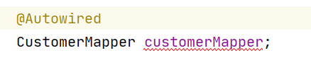
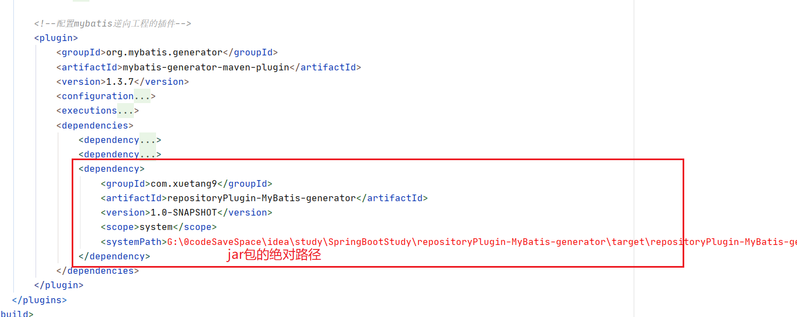
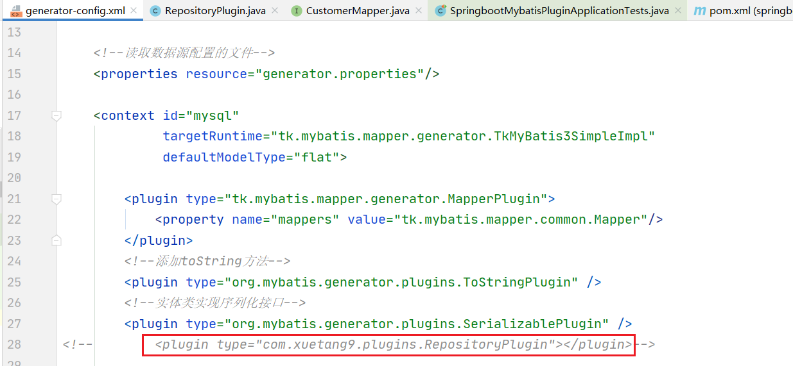

# mybatis.generator插件-扩展

## 一、问题描述

自动生成的Mapper可以直接自动注入，但是因为没有自动生成@Repository注解，在idea使用时会报错（自动检查）报错不影响实际使用，

这里使用的方式是通过自定义mybatis.generator插件扩展自动生成@Repository注解

## 二、使用

~~~
// 导入jar包
      <dependency>
            <groupId>org.mybatis.generator</groupId>
            <artifactId>mybatis-generator-core</artifactId>
            <version>1.3.7</version>
        </dependency>
~~~

### 1.在插件中引用自定义jar包依赖

~~~
<dependency>
                        <groupId>com.xuetang9</groupId>
                        <artifactId>repositoryPlugin-MyBatis-generator</artifactId>
                        <version>1.0-SNAPSHOT</version>
                        <scope>system</scope>
                        <systemPath>G:\4.workSaveSpace\老九\Electric-power-inspection\projects\power-inspection-system\lib\repositoryPlugin-MyBatis-generator-1.0-SNAPSHOT.jar</systemPath>
                    </dependency>
~~~

### 2.在配置中添加插件

~~~
<?xml version="1.0" encoding="UTF-8"?>
<!DOCTYPE generatorConfiguration
        PUBLIC "-//mybatis.org//DTD MyBatis Generator Configuration 1.0//EN"
        "http://mybatis.org/dtd/mybatis-generator-config_1_0.dtd">
<generatorConfiguration>
    <!--在pom文件中的配置-->
    <!--    &lt;!&ndash;配置mybatis使用tk-mapper生成实体类，Mapper接口 以及映射文件的位置&ndash;&gt;-->
    <!--    <targetProjectJava>${basedir}/src/main/java</targetProjectJava>-->
    <!--    <targetProjectResources>${basedir}/src/main/resources</targetProjectResources>-->
    <!--    <targetPackageModel>com.xuetang9.springbootmybatisplugin.domain</targetPackageModel>-->
    <!--    <targetPackageSql>mapper</targetPackageSql>-->
    <!--    <targetPackageMapper>com.xuetang9.springbootmybatisplugin.mapper</targetPackageMapper>-->

    <!--读取数据源配置的文件-->
    <properties resource="generator.properties"/>

    <context id="mysql"
             targetRuntime="tk.mybatis.mapper.generator.TkMyBatis3SimpleImpl"
             defaultModelType="flat">

        <plugin type="tk.mybatis.mapper.generator.MapperPlugin">
            <property name="mappers" value="tk.mybatis.mapper.common.Mapper"/>
        </plugin>
        <!--添加toString方法-->
        <plugin type="org.mybatis.generator.plugins.ToStringPlugin" />
        <!--实体类实现序列化接口-->
        <plugin type="org.mybatis.generator.plugins.SerializablePlugin" />
<!--        <plugin type="com.xuetang9.plugins.RepositoryPlugin"></plugin>-->

        <jdbcConnection driverClass="${spring.datasource.driver-class-name}"
                        connectionURL="${spring.datasource.url}"
                        userId="${spring.datasource.username}"
                        password="${spring.datasource.password}">
            <property name="nullCatalogMeansCurrent" value="true"/>
        </jdbcConnection>

        <!--配置实体类生成的位置-->
        <javaModelGenerator targetPackage="${targetPackageModel}"
                            targetProject="${targetProjectJava}"/>
        <!--配置maper映射文件的位置-->
        <sqlMapGenerator targetPackage="${targetPackageSql}"
                         targetProject="${targetProjectResources}"/>

        <!--配置mapper接口的位置-->
        <javaClientGenerator targetPackage="${targetPackageMapper}"
                             targetProject="${targetProjectJava}" type="XMLMAPPER"/>

        <table tableName="%" mapperName="{0}Mapper">
            <generatedKey column="id" sqlStatement="mysql" identity="false"/>
        </table>
    </context>
</generatorConfiguration>
~~~

### 3.生成的jar包放在对应资源文件夹下

### 4.正常使用

#### 

## 三、原理

### 1.自定义原理

如何添加自定义注解https://blog.csdn.net/fanyunxing/article/details/87659692

### 2.使用jar包的原因

要想使用自定义依赖必须通过jar包的方式https://blog.csdn.net/u_ascend/article/details/80742919

### 3.自定义插件源码

~~~java
package com.xuetang9.plugins;

import org.mybatis.generator.api.IntrospectedTable;
import org.mybatis.generator.api.PluginAdapter;
import org.mybatis.generator.api.dom.java.FullyQualifiedJavaType;
import org.mybatis.generator.api.dom.java.Interface;
import org.mybatis.generator.api.dom.java.TopLevelClass;

import java.util.List;

/**
 * @类: RepositoryPlugin
 * @描述:
 * @date: 2020/4/30
 * @author: Admin
 * @ver 1.0.0
 * @since JDK 1.8
 */

public class RepositoryPlugin extends PluginAdapter {

    @Override
    public boolean validate(List<String> list) {
        return true;
    }

    public RepositoryPlugin() {

    }

    @Override
    public boolean clientGenerated(Interface interfaze, TopLevelClass topLevelClass, IntrospectedTable introspectedTable) {
        interfaze.addImportedType(new FullyQualifiedJavaType("org.springframework.stereotype.Repository"));
        interfaze.addAnnotation("@Repository");
        return true;
    }

}
~~~

~~~

~~~

